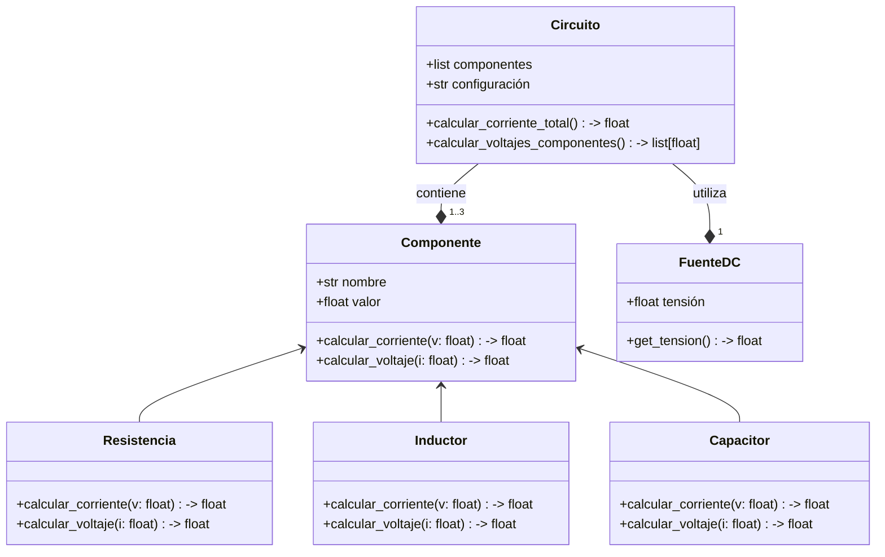

A continuación se presenta la propuesta del diagrama de clases para simular circuitos eléctricos en corriente directa utilizando POO:

Por otra parte, para crear las gráficas de tensión y corriente se planea utilizar matplotlib.
